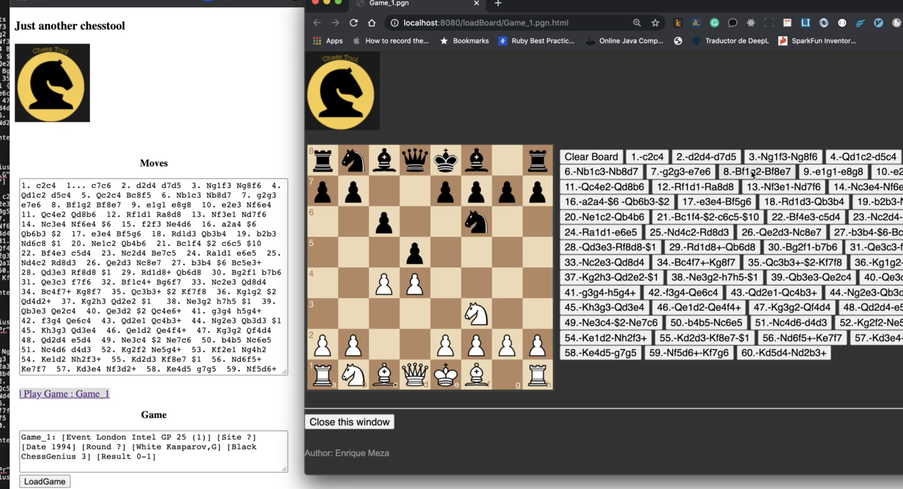

ChessTool

## Description
A tool to load pgn(parse) and reproduce chess games using step by step FEN positions.

## Get project source
`$ git clone https://github.com/emezac/chesstool.git`

## Environment setup
Install `python 3.8` if you don't have it, and then do:
`pip install pipenv`
`pipenv install`

Download and install cheetah from here:

https://github.com/CheetahTemplate3/cheetah3

then

under cheetah directory execute: 

`python3 setup.py sdist`

finally execute :

`pipenv install cheetah/dist/Cheetah3-3.2.7a0.tar.gz` 

Download and install pgn-extract:
https://www.cs.kent.ac.uk/people/staff/djb/pgn-extract/

#Please change this line on main.py

FILE_SYSTEM_ROOT = "/Users/enrique/code/new/chesstool/pgnfiles"

accordingly your environment

## Start web service
`./start.sh`

Then you can see the app  at [http://localhost:8080/]

Demo:

https://youtu.be/9_lH4RpUDRo

Screenshot:

